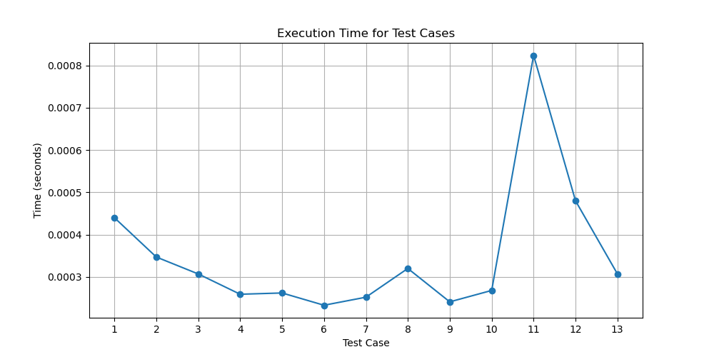

# Dynamic Programming Assignment
Python implementation Longest Common Substring with weights of alphabetical letters

## Authors
* Nicholas Farr UFID: 17993779
* Trevor Gross UFID: 11440394

## Project Structure
```
dynamicprogramming/
├── src/
│   ├── hvlcs.py    # Code and functions for algorithm, includes backtracking helper function to retreive the strings.
│   ├── main.py          # Ingests input, runs algorithms, and creates output file
│   └── test_generator.py       # Generate test cases and files
├── data/                    # Input/Output test files
└── tests/            # Input test files
```

## Prerequisites
* Python [version, e.g., 3.10+]
* Matplotlib

### Data Formatting

#### Input
Input data must be placed into `data/input.in` and formatted as follows:
```
k
l1 v1
l2 v2
l3 v3
A
B
```
Where:
* `k` = number of alphabetical value pairings (`k >= 1`)
* `l1 v1....` = letter, value pairings
* `A` = String A
* `B` = String B

#### Output
Output data will be placed in `data/output.out` and formatted as follows:
```
<largest substring value>
<largest substring>
```

## Running the Algorithms
* Create input based on instructions above
* Run the following command from the `dynamicprogramming/` directory: `python src/main.py`
* Examine the output in the `data/output.out` file

## Written Component

### Question 1


### Question 2

Recurrence Equation:

$\text{Case 1}  - A[i] == B[j]$:

$\text{Value}[A[i]] + \text{OPT}(i-1,j-1)$

$\text{Case 2} - A[i] != B[j]:$

$\max(OPT(i-1,j), \text{OPT}(i,j-1))$

Base Cases:

$\text{OPT}(i, 0) = 0, \text{OPT}(0,j) = 0$


Correctness:

This recurrence equation is correct because it considers both cases optimally, if $A[i] == B[j]$ and these values are not appended to the optimal solution, we could append this matched character, and with the assumption that $\text{Value}[A[i]] > 0$, this would only increase the sum of the substring, contradicting the optimal solution. If $A[i] != B[j]$, then we do not use at least one of these characters, meaning the best we can do is either $\text{OPT}(i,j-1)$ or $\text{OPT}(i-1,j)$, and our recurrence equation takes the one with a larger value, assuring the best possible outcome.


### Question 3

```
function HVLCS_length(A, B)
    # Base case
    if K is 0 or A or B are empty
        return 0
    
    m = length(A)
    n = length(B)
    M is an (m x n) 2D array, with all entries set to 0


    for i = 1 to m + 1
        for j = 1 to n + 1
            if A[i-1] is the same character as B[j-1]
                M[i][j] = M[i-1][j-1] + 1
            else
                M[i][j] = max{M[i-1][j], M[i][j-1]}
    return M[m][n]
```

The runtime of `HVLCS_length' is $O(mn)$.
